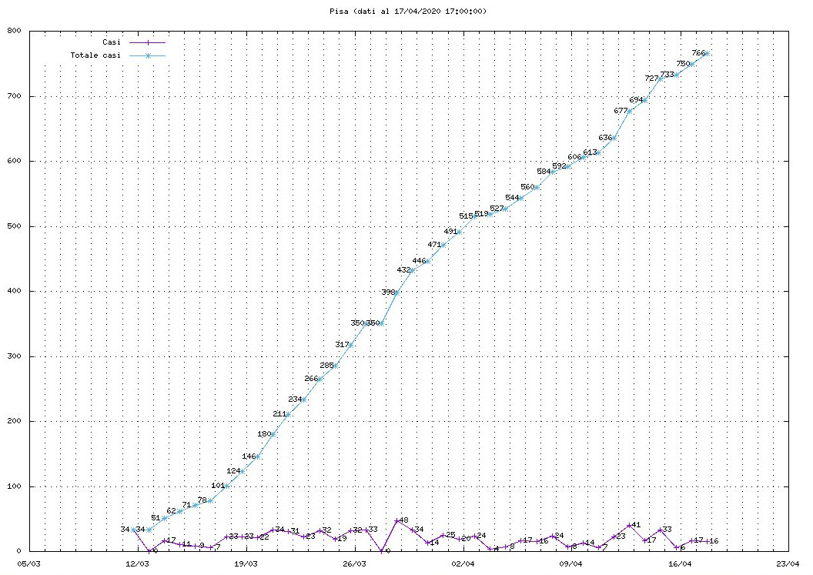
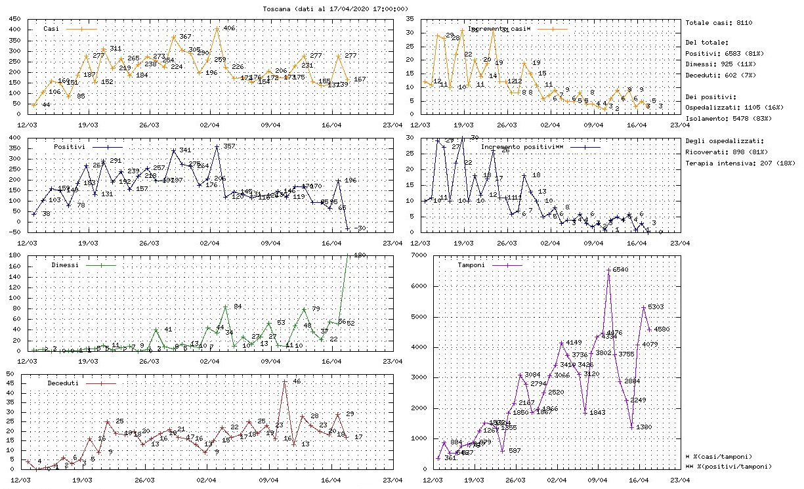

# covid19it
Linux. Tool a riga di comando per visualizzare i dati sulla situazione COVID19 in Italia.

## Uso
Senza argomenti mostra la situazione italiana. Ogni argomento è il nome di una provincia o di una regione.

Es: il seguente comando mostra i dati della Toscana e della provincia di Pisa:

`covid19it Toscana Pisa`

## Bash completion
L'autocompletamento degli argomenti nella bash è possibile eseguendo il seguente comando:

`source complete/complete.bash`

## Screenshot

### Provincia

### Regione

